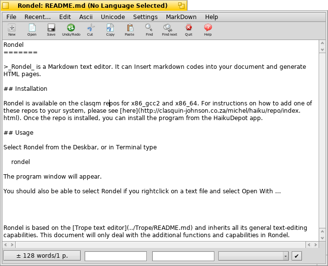
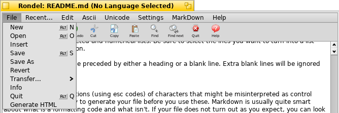
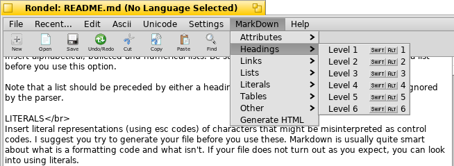

Rondel
=======

>_Rondel_ is a Markdown text editor. It can Insert markdown codes into your document and generate HTML pages.

## Installation

Rondel is available on the clasqm repos for x86_gcc2 and x86_64. For instructions on how to add one of these repos to your system, please see [here](http://clasquin-johnson.co.za/michel/haiku/repo/index.html). Once the repo is installed, you can install the program from the HaikuDepot app.

## Usage

Select Rondel from the Deskbar, or in Terminal type 

    rondel

The program window will appear.

You should also be able to select Rondel if you rightclick on a text file and select Open With ...

 

Rondel is based on the Trope text editor and inherits all its general text-editing capabilities, which have been documented [here](../Trope/README.md). This document will only deal with the additional functions and capabilities in Rondel.

### The File menu 

 

**Operations that affect files.**

GENERATE HTML 
Create a html file in the same directory as your Markdown file. If an html file with the same name already exists there, it will be overwritten. This command is also available from the MarkDown menu. For this to work, you should have placed the _mkd2html_ utility somewhere in your path. The _discount_ package is stipulated as a dependency for this package, so this should not be an issue.

If your html file is not generated: chances are that your markdown file is in a path that contains a period. The directories that _mkd2html_ can parse can contain spaces and hyphens but NO PERIODS. Therefore the file named

    /boot/home/apps/yab-1.5/Programs/Rondel/RondelCheatSheet

will appear not to generate because of the presence of "1.5" in the pathname. In fact,it will exist, but as /boot//home/apps/yab-1.html. The solution: Just move your file to, say, the desktop temporarily, load it into Rondel and it will generate html flawlessly. This is a known limitation of the _mkd2html_ helper program.

Periods that indicate a file extension, like .md or .txt, will be processed correctly.

Please note that the html file is currently not being automatically launched in a browser once it has been generated.

### The Markdown menu

 

**Insert markdown codes.**

Rondel (or rather the _mkd2html_ utlity) actually supports **all** canonical markdown structures plus a few extensions, but not all alternatives will be presented in Rondel's menu system. See the Rondel Cheat Sheet for details, or even better, load it into Rondel and generate it, then view the HTML file in WebPositive!

ATTRIBUTES 
Insert Bold, Bold Italic or Italic text (actually these are translated to HTML emphasis and strong codes, but 99% of browsers display them that way).

HEADINGS 
Insert six levels of heading. Please note that headings are not compatible with the centered text code under the OTHER submenu.

LINKS 
Insert automatic, manual and reference links.

LISTS 
Insert alphabetical, bulleted and numerical lists. Be sure to select the lnes you want to turn into a list before you use this option.

Note that a list should be preceded by either a heading or a blank line. Extra blank lines will be ignored by the parser.

LITERALS 
Insert literal representations (using esc codes) of characters that might be misinterpreted as control codes. I suggest you try to generate your file before you use these. Markdown is usually quite smart about what is a formatting code and what isn't. If your file does not turn out as you expect, you can look into using literals.

OTHER 
Insert other Markdown structures.

TABLE 
Insert a table of maximum 5 columns by 2 rows. The current version of _mkd2html_ is having trouble with tables of more than two rows. When this is fixed, larger tables will be enabled in Rondel

GENERATE HTML 
Create a html file in the same directory as your Markdown file. If an html file with the same name already exists there, it will be overwritten. This command is also available from the File menu, where more information is provided in this Help file.

## Acknowledgements
This product includes freeware toolbar icons from
http://hongkiat.com/blog/toolbar-icon-set/

