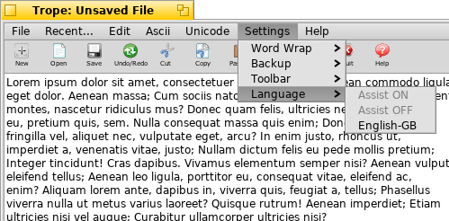

Trope
=======

>_Trope_ is a text editor.

## Installation

Trope is available on the clasqm repos for x86_gcc2 and x86_64. For instructions on how to add one of these repos to your system, please see [here](http://clasquin-johnson.co.za/michel/haiku/repo/index.html). Once the repo is installed, you can install the program from the HaikuDepot app.

## Usage

Select Trope from the Deskbar, or in Terminal type 

    trope

The program window will appear.

You should also be able to select Trope if you rightclick on a text file and select Open With ...

 

### The File menu 

 

**Operations that affect files.**

NEW (or Alt-F) 
Open a new, empty window.

OPEN (or Alt-O) 
Open a file. A dialog box appears in which you can choose which file to open. Please note that you can also drop a text file on any new, blank window from the Desktop or any Tracker window.You should not, however, drop more than one file simultaneously. Only one of them will load.

Note: Trope will quite happily open more than one instance of the same file, and you might end up saving different versions over one another.

INSERT 
Insert a file into the current file.

SAVE (or Alt-S) 
Save the file. If it has not been saved before, you will get a chance to choose a destination directory and a name for the file. Names with spaces in them should be OK.

SAVE AS 
Save the file under a new name and/or destination.

REVERT 
Lose all changes and go back to the last saved version of your file.Only becomes available once the file has been saved at least once.

Note: Don't ever try to name a file --ReVeRtFiLe-- because that is a code the app uses internally for this function. Things could get unpredictable in a hurry.

TRANSFER 
Although Trope is the greatest text editor ever ;-) there are others. This Function allows you to transfer the file to Pe or StyledEdit and closes the current window. I have other Text Editors and Text-handling utilities in the works. Once these are available and if you have them installed, they will automagically appear in this menu.

QUIT (or press ALT-Q) 
Quit the program
### The Recent... menu

 

CLEAR RECENT FILES 
Empty the list of recently used files.

The rest of this menu is populated with the ten most recently opened files. First open a blank window, then click on one of them to open it.

### The Edit menu

 

**Operations that affect your text**

UNDO/REDO (or ALT-Z) 
Undoes the last editing action. If nothing else has happened since, you can then Redo, that is, undo the undo. Sorry, one level of undo only, no buffer.

CUT, COPY & PASTE 
These commands carry out the usual clipboard actions.

COPY TO SNIPPET 
Copy the currently selected text to the Snippets dropdown (see below).

SORT 
Sorts a selected block of lines in four specifiable ways: alphabetical, reverse alphabetical, numerical and reverse numerical. You cannot sort the entire file directly, but you can always select the entire file, and then sort.

CLEAR SELECTION 
Deleted the currently selected text.

CLEAR ALL 
Clear the entire window. If you use this command by mistake, just use the Undo function (see above).

FIND 
Find the next occurence of the text in the Find input box in the lower right corner of the window. You can also just type your text in there and press ALT-F. Pressing ENTER interfered with the Replace function and was disabled

FIND AGAIN 
Find the next occurrence of the previous Find operation

REPLACE 
A fairly primitive GLOBAL, case-dependent search-and-replace using the text in the Find and Replace input boxes at the bottom of the window. You can also just type your text in there and press ALT-R

Note: I have no plans to implement a proper Replace function in Trope. Frankly, I don't see the point of competing with the superb replace function in Pe. But it's public domain code: feel free to give it a go.

SELECT ALL 
Select all text.

SPELLING 
Gives access to the SpellChecker and related functions. To spell-check, you first need to select a language from the Settings Menu. While spell-checking happens, in a separate window, your document will be greyed out and not editable. UK English is installed by default. Language packs are separately installed either from the Help menu or via Haikudepot.

Spellchecking automatically creates a backup file with the .bak extension in the same directory as the original file. In this version of the editor, you can only spellcheck the entire file, not a selection of text. Please note that the current version of aspell on Haiku sometimes gets stuck on detecting High-ASCII and Unicode characters, in which case you will have to just choose (i)gnore and move on. Sorry about that

SORT 
Sorts selected text in four different ways

SPACING 
These options let you double- or triplespace a document, remove all blank lines, or insert three spaces at the beginning of every line/paragraph. This affects the entire document.

CASE 
Change the case of selected text in four different patterns.

WHITESPACE 
A variety of options to manipulate the appearance of your text. This affects the entire document.

NUMBERING 
Number the lines in your text. This can not be reversed, unless you decline to save the file first and then use File|Revert.

CONVERT 
Switch between Linux/Haiku/Mac OSX and DOS/Windows line endings. You should not ordinarily need this. But it's there.

### The Ascii menu

 

This menu allows you to insert high-ASCII accented and other characters. Note that you can always use Haiku's Character Map.The character is also copied to the system clipboard, so you can use it again.

### The Unicode menu

 

This menu allows you to insert UniCode accented characters. Latin characters only, sorry, and even then only those I can figure out. If you want an editor for Cyrillic, Cherokee or CJK character sets, grab the Trope source and roll your own. You have my blessings. Note that you can always use Haiku's Character Map.The character is also copied to the system clipboard, so you can use it again.

It is quite possible that I have messed up the organization of these characters. Perhaps in your language, an "i" with a macron above and a dot below it is not an "i" at all but is pronounced "Aaaaaaaargh"! If so, contact me (clasqm at gmail dot com) and we'll see what we can do. The same is true if I missed a character somewhere.

### The Settings menu

 

**Operations that change the appearance and functioning of the Editor**

Note that the Settings in this window will reflect the last settings changes you made in ANY window. You open window A and from there new window B, You change settings in window B, You now change back to window A. and decide to open window C. Window C will open with the setting changes you made in Window B.

WORD WRAP | ON 
WORD WRAP | OFF 
Word wrap is ON by default when you first start the program, but you can change that. Please note that this is a global setting. You can have two windows open, one with word wrap on and another with it off. But the next Trope window you open, whether it is seconds or months later, will have the setting of the last window you closed. The setting does not get saved with a specific document.

WORD WRAP | RE-WRAP 
You only need this if you have word wrap set to ON and you have resized the window. It will redo the word wrappingto fit the new window size.

BACKUP | ON 
BACKUP | OFF 
If set to ON, every time you save your file this creates a duplicate file with the extension .bkp in the same directory where your original file resides. Like word wrap, this is a global setting and will be remembered the next time you open the program.

TOOLBAR | GRAPHICS ON 
TOOLBAR | GRAPHICS OFF 
Lets you choose whether to use a graphical overlay over the toolbar. Switching the overlay off is recommended for slow systems. Like word wrap, this is a global setting and will be remembered the next time you open the program.

LANGUAGE 
Select a language for this document. Once you have selected a language (depending on which packs you have installed), SpellAssist (my fancy name for autocompletion) is switched ON if that pack has a functional SpellAssist dictionary - not all do - but you can aslo switch it OFF from this menu. This menu is also used to select a language for spell-Checking. Trope ships with a British English dictionary: other languages must be installed via the packaging system.

### The Help menu

 

**Offline help**

HELP (or ALT-H) 
Display the Help for this program.

HTML HELP 
Display the Help for this program in your default browser.

CHARACTERS ... 
Pastes all currently available High-Ascii and UniCode characters into the current document.

LOREM IPSUM 
insert a specified number of filler text into your document. A variety of options are offered over and above the usual fake Latin one.

INSTALL 
This only appears when the system detects that there are uninstalled dictionary packs. If you want more information on what is in each pack, rather use HaikuDepot.

ABOUT 
Display an About box.

### The Toolbar

 

The toolbar below the menu gives quick access to some of the most commonly-used functions. Toolbar items will always be the same across all Trope-based applications

### The Status button

 

The status button in the bottom left corner gives you an APPROXIMATE word and page count, based on the assumption that anything separated by one or more spaces or tabs or a new line is a word and that a page is 300 words. It does not update live, only every time you choose a menu command. You can also press the button to update it manually.

### The Search field

 

The Search field in the bottom right corner lets you enter text to do a case-insensitive search of your document. Type the text you want to search for, then press ALT-F.

### The Snippets dropdown

 

The Snippets dropdown in the bottom far right corner allows you to store up to 15 short pieces of text and paste them elsewhere in your document. Create snippets by selecting text and selecting Copy to Snippet from the Edit menu. To paste a snippet into your text, select the one you want, then press the button marked ✔ to the right of the dropdown selector.

Snippets are NOT saved between sessions or between documents.

## Acknowledgements
This product includes freeware toolbar icons from
http://hongkiat.com/blog/toolbar-icon-set/

