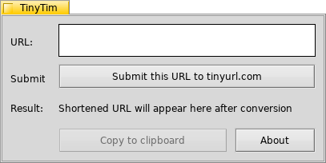
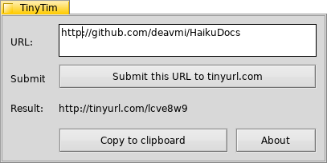

TinyTim
=======

>_TinyTim_ is a small utility that provides a graphical front-end to the [tinyurl](http://tinyurl.com) URL-shortening service.

## Installation

TinyTim is available on the clasqm repos for x86_gcc2 and x86_64. For instructions on how to add one of these repos to your system, please see [here](http://clasquin-johnson.co.za/michel/haiku/repo/index.html). Once the repo is installed, you can install the program from the HaikuDepot app.

## Usage

Select TinyTim from the Deskbar, or in Terminal type 

    tinytim

(in lowercase). The program window will appear.

Enter the URL in the entry field and click on the button named "Submit this URL to tinyurl.com". After a brief interval, the shortend URL will be displayed below the button. You can now click the button named "Copy to clipboard" to copy the short URL to the Haiku system clipboard.

PLEASE NOTE: The tinyurl API does not handle the _https_ protocol. Just change the URL to read _http_. Your browser will know to change it back when you use the shortened URL.
