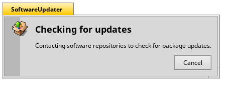
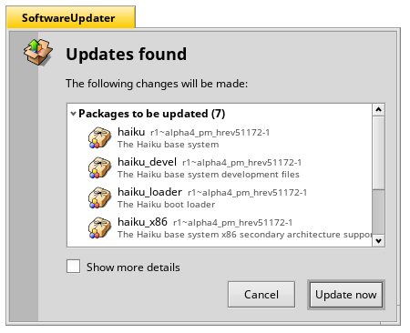
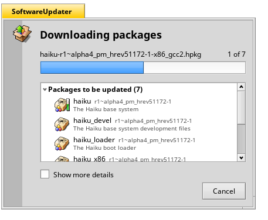
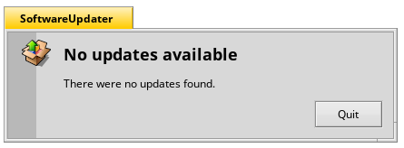
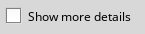
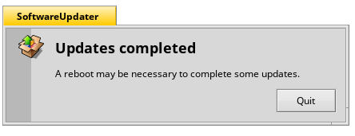

SoftwareUpdater
===============

>_SoftwareUpdater_ is a program that checks your system for updated packages and allows you to install them at the click of one button.

## Usage

When you launch SoftwareUpdater it will check your repositories for updated packages:

---

Once it has checked for updates it will list all the packages that are to be updated. You can then click the `Update now` button and the program will download and install the packages or you can click `Cancel` button to cancel the updating of packages. It will also show you not just a lit of _Packages to be updated_ but also _New packages_ - thse being new packages that are to be installed as they are now required by an updated package:

---

Whilst the updates are being downloaded you will be able to see a prohgress bar indicating the progress of the download of the current package (named above the bar). Similarly there is also a green vertical progress bar on the icon of the currently downloading package indicating the progress of its download. If one wants to cancel the updates then just click the `Cancel` button.

---

If no updates are available at the time of checking then you will get a message like below and can click `Quit` to close SoftwareUpdater:

---

Checking the `Show more details` checkbox will show more information on each package. Such as what repository it comes from and to what version it is being updated to:

---

Once the updates have been installed SoftwareUpdater will notify you that you may need to reboot your system for the updates to be applied. You can then click `Quit` to exit SoftwareUpdater:

